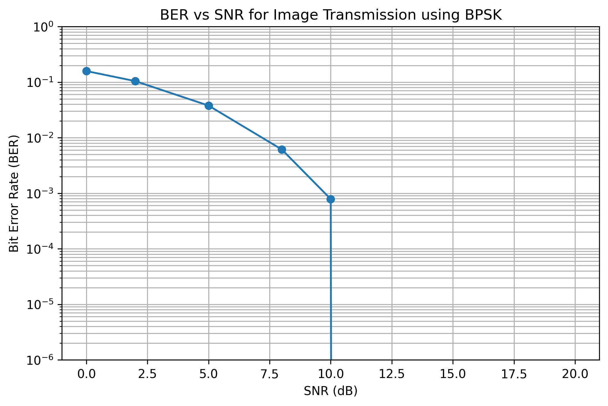
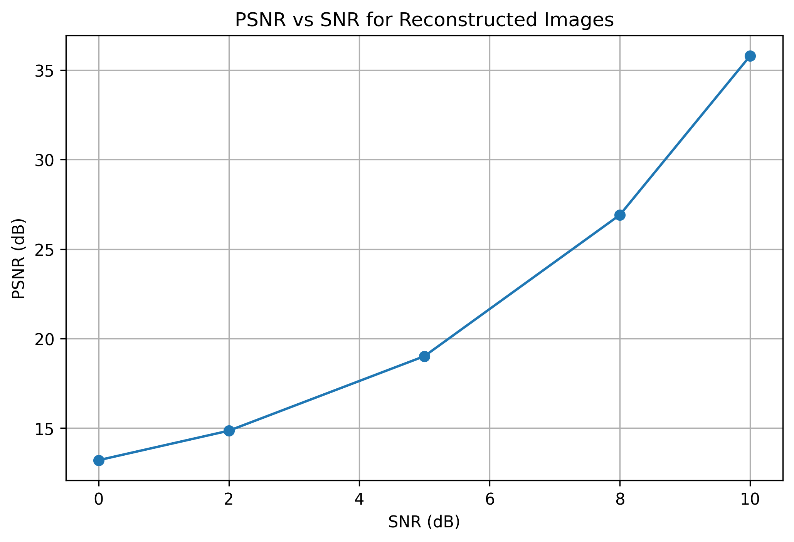
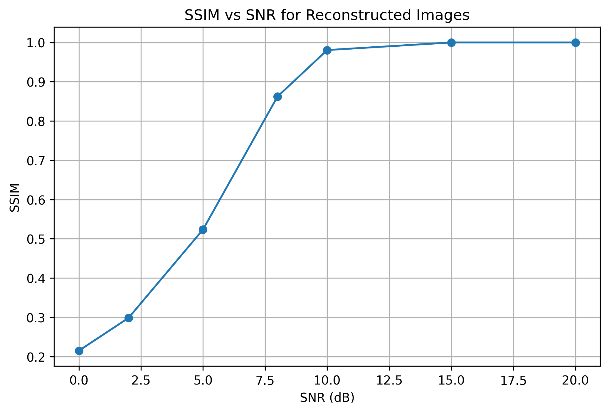
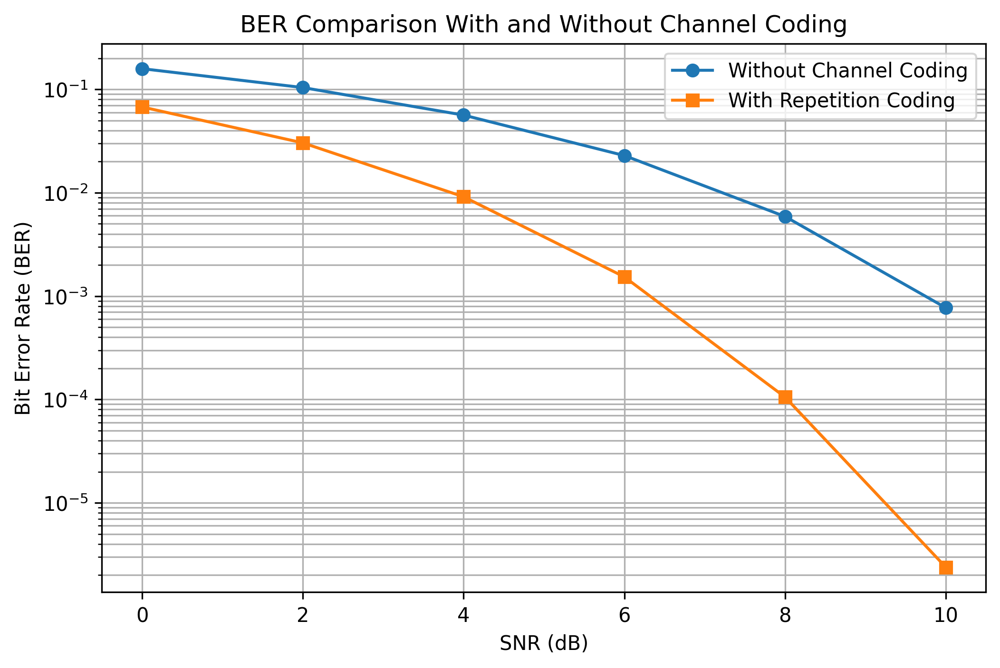

# JPEG-like Image Compression and Digital Transmission Simulator

This project implements a simplified image compression and digital transmission pipeline in Python.

The first stage is based on a JPEG-like compression algorithm, including color space conversion, chroma subsampling, block-based Discrete Cosine Transform (DCT), quantization, zig-zag scanning, Run-Length Encoding (RLE), Huffman coding, image reconstruction and quality evaluation.

The second stage simulates the digital transmission of image data over a noisy communication channel using BPSK modulation and an AWGN channel model. The transmission performance is evaluated using Bit Error Rate (BER), Peak Signal-to-Noise Ratio (PSNR) and Structural Similarity Index (SSIM).

The goal of this project is to study the relationship between image compression, channel noise, bit errors and reconstructed image quality.

---

## Motivation

Digital images often require a large number of bits to be stored or transmitted. In bandwidth-limited communication systems, such as satellite links, drones, IoT cameras, remote sensing devices and embedded systems, image compression and robust transmission techniques are essential.

This project explores two important stages of a digital communication system:

1. **Source coding**, represented by the JPEG-like image compression pipeline.
2. **Digital transmission**, represented by BPSK modulation over an AWGN channel.

The project also illustrates important trade-offs in communication systems, such as:

* Compression ratio vs reconstructed image quality
* Signal-to-noise ratio vs bit error rate
* Channel noise vs visual degradation
* Transmission reliability vs bandwidth efficiency

---

## Project Overview

The project is divided into two main parts.

### 1. JPEG-like Image Compression

The image compression pipeline follows the main ideas behind the JPEG standard:

```text
Original RGB Image
        ↓
RGB to YCbCr Conversion
        ↓
Chroma Subsampling
        ↓
8x8 Block Splitting
        ↓
Discrete Cosine Transform (DCT)
        ↓
Quantization
        ↓
Zig-zag Scanning
        ↓
Run-Length Encoding
        ↓
Huffman Coding
        ↓
Compressed Representation
```

The decompression stage applies the inverse operations to reconstruct the image and evaluate the quality loss introduced by compression.

---

### 2. Digital Image Transmission

The digital communication stage simulates the transmission of image data through a noisy channel:

```text
Grayscale Image
        ↓
Image-to-Bitstream Conversion
        ↓
BPSK Modulation
        ↓
AWGN Channel
        ↓
BPSK Demodulation
        ↓
Received Bitstream
        ↓
Image Reconstruction
        ↓
BER, PSNR and SSIM Evaluation
```

This stage allows the analysis of how channel noise affects both the transmitted bits and the reconstructed image quality.

---

## Features

* JPEG-like image compression
* RGB to YCbCr color space conversion
* Chroma subsampling
* 8x8 block processing
* Discrete Cosine Transform (DCT)
* Quantization
* Zig-zag scanning
* Run-Length Encoding (RLE)
* Huffman coding
* JPEG-like image reconstruction
* Compression ratio calculation
* PSNR and SSIM image quality evaluation
* Image-to-bitstream conversion
* BPSK digital modulation
* AWGN channel simulation
* BPSK demodulation
* Bit Error Rate (BER) calculation
* Image transmission over a noisy channel
* BER, PSNR and SSIM analysis for different SNR values
* Automatic saving of images, plots and result tables

---

## Project Structure

```text
jpeg-compression-python/
├── data/
│   └── input/
│       └── sample_image.png
│
├── results/
│   ├── images/
│   ├── plots/
│   └── tables/
│
├── jpeg_compression.ipynb
├── huffman.py
├── utils.py
├── README.md
├── requirements.txt
├── .gitignore
└── LICENSE
```

---

## Installation

Install the required Python libraries using:

```bash
pip install -r requirements.txt
```

The main dependencies are:

* NumPy
* OpenCV
* Matplotlib
* Pandas
* scikit-image
* Jupyter Notebook

---

## How to Run

Open the notebook:

```bash
jupyter notebook jpeg_compression.ipynb
```

Then run all cells:

```text
Kernel → Restart & Run All
```

After execution, the generated results will be automatically saved in the `results/` directory.

---

## Input Image

The input image should be placed inside:

```text
data/input/
```

The default image path used in the notebook is:

```text
data/input/sample_image.png
```

To use another image, place it inside the `data/input/` folder and update the image path in the notebook.

---

## Results

### JPEG-like Compression Results

The JPEG-like compression stage reconstructs the image after applying transform coding, quantization and entropy coding.

The reconstruction quality is evaluated using PSNR and SSIM.


---

### Digital Image Transmission Results

The grayscale image is converted into a binary bitstream and transmitted using BPSK modulation over an AWGN channel.

Lower SNR values introduce more bit errors, which degrade the reconstructed image. Higher SNR values reduce the BER and improve image quality.


---

## Performance Metrics

### Bit Error Rate

The Bit Error Rate measures the fraction of incorrectly received bits:

```text
BER = number of bit errors / total number of transmitted bits
```

A lower BER means a more reliable transmission.

---

### Peak Signal-to-Noise Ratio

PSNR measures the reconstruction quality of the received image. Higher PSNR values indicate better image quality.

---

### Structural Similarity Index

SSIM measures the structural similarity between the original and reconstructed images. Values close to 1 indicate high similarity.

---

## BER vs SNR

As the SNR increases, the channel becomes less noisy and the Bit Error Rate decreases.



---

## PSNR vs SNR

As the SNR increases, the reconstructed image becomes closer to the original image, increasing the PSNR.



---

## SSIM vs SNR

As the SNR increases, the structural similarity between the original image and the received image improves.



---

## Channel Coding

A simple repetition code was also tested as an introductory channel coding technique.

The repetition code transmits each bit multiple times and applies majority voting at the receiver. This reduces the Bit Error Rate, but increases the number of transmitted bits.

This illustrates an important trade-off in digital communication systems:

```text
Higher reliability ↔ Higher transmission overhead
```



---

## Applications

This project can be applied as a simulation tool for studying image transmission in bandwidth-limited and noisy communication systems.

Possible application scenarios include:

* Satellite image transmission
* Drone-based image transmission
* Remote sensing systems
* IoT camera networks
* Industrial monitoring
* Embedded vision systems
* Wireless image transmission
* Educational demonstrations in digital communications and signal processing

In these scenarios, images often need to be compressed before transmission and reconstructed after passing through a noisy communication channel.

---

## Current Limitations

At the current stage, the JPEG-like compression module and the digital communication module are implemented, but the full transmission of the JPEG-compressed bitstream is still under development.

Current limitations include:

* The digital transmission stage currently uses grayscale pixel bits directly.
* The JPEG-compressed bitstream is not yet fully integrated with the communication channel.
* BPSK is the main implemented modulation scheme.
* The channel model is AWGN only.
* Repetition coding is used as a basic channel coding technique.
* More advanced modulation and channel coding techniques are planned for future versions.

---

## Future Improvements

Planned future improvements include:

* Integrating the JPEG-compressed bitstream with the digital communication channel
* Comparing compressed and uncompressed image transmission
* Adding QPSK modulation
* Adding 16-QAM modulation
* Implementing Hamming channel coding
* Implementing convolutional coding and Viterbi decoding
* Adding packetization and CRC error detection
* Simulating burst errors and packet loss
* Comparing different channel coding strategies
* Evaluating bitrate-distortion trade-offs
* Organizing the code into reusable Python modules
* Creating a command-line interface for running experiments
* Adding automated tests
* Improving documentation and result visualization

---

## Technical Concepts Covered

This project combines concepts from different areas of electrical engineering, telecommunications and signal processing:

* Digital image processing
* Image compression
* Transform coding
* Discrete Cosine Transform
* Quantization
* Entropy coding
* Huffman coding
* Digital communication systems
* BPSK modulation
* AWGN channel modeling
* Bit Error Rate analysis
* Image quality metrics
* Source coding
* Channel coding

---

## Technologies Used

* Python
* NumPy
* OpenCV
* Matplotlib
* Pandas
* scikit-image
* Jupyter Notebook

---

## Author

Vinicius Hiroshi B Shinzato

Telecommunications Engineering Student
University of Campinas - Unicamp

---

## License

This project is licensed under the MIT License.
